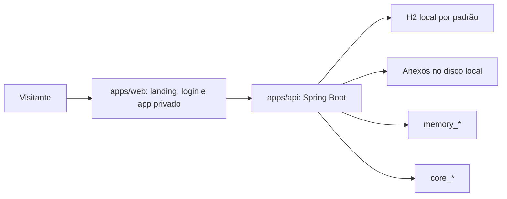
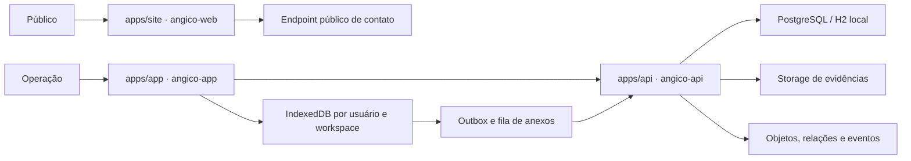

# Plano de reconstrução do Angico

Data: 10 de julho de 2026  
Branch: `feat/angico-rebuild`

## Objetivo

Transformar o Angico em três produtos implantáveis de forma independente: um site público, uma aplicação operacional offline-first e uma API responsável por autenticação, autorização, dados, ontologia, sincronização, mensagens e auditoria.

A reconstrução preserva os fluxos que já funcionam, a identidade visual, os dados locais existentes e o histórico Git. Não serão mantidos dados fictícios, credenciais conhecidas, promessas sem implementação ou camadas duplicadas sem consumidor real.

## Princípios de produto

- O objeto principal não é o formulário, o mapa ou o indicador isolado, mas o percurso verificável entre território, pessoas, organizações, ações, evidências, resultados e decisões.
- A ontologia deve aparecer na navegação de cada objeto: o usuário precisa ver o que aconteceu, onde, quando, por quem, com qual evidência e qual consequência registrada.
- O registro de campo deve caber em poucos passos no celular e continuar íntegro sem conexão. Estado local, pendência, conflito e confirmação remota nunca serão apresentados como se fossem equivalentes.
- Evidência sustenta uma afirmação de impacto; não é apenas um anexo. Resultado sem vínculo, autoria ou prova permanece explicitamente incompleto.
- Inteligência significa revelar relações e lacunas objetivas para apoiar uma decisão humana. Não haverá pontuação opaca, recomendação sem origem ou automação sem ação explicável.
- Missão e ação representam, respectivamente, iniciativa e atividade operacional. Novos conceitos só entram no domínio quando possuírem fluxo, persistência e uso visível; a ontologia não será preenchida com entidades decorativas.
- O Angico é socioambiental e comunitário. Fluxos de materiais são casos possíveis, não a identidade inteira do produto.

## Linha de base verificada

- Frontend: React 19, TypeScript 6, Vite 8, React Router e React Leaflet.
- Backend: Java 25, Spring Boot 4, Spring MVC, Spring Data JPA, H2 e PostgreSQL.
- Build do frontend: aprovado; bundle principal de 463,25 kB, 139,97 kB comprimido.
- Auditoria de dependências do frontend: nenhuma vulnerabilidade conhecida.
- Testes do backend: 14 aprovados, sem falhas.
- Docker da API: build aprovado e `/health` respondeu `UP` em ambiente isolado.
- Estado visual atual registrado em `/tmp/angico-before-home.png` e `/tmp/angico-before-login.png`.
- Alterações locais preservadas: favicon em `apps/web/index.html` e novo arquivo `apps/web/src/assets/angico-icone.png`.
- NeuroTrace: o conector não está disponível nesta sessão; nenhuma memória foi criada ou alterada.

## Arquitetura atual

### Site institucional

A landing vive no mesmo bundle, roteador, stylesheet, service worker e deployment da aplicação privada. Visitantes baixam código de mapa, mensagens, perfil e módulos internos. As chamadas de demonstração levam ao guard de autenticação, portanto não existe uma demonstração pública real.

### Aplicação autenticada

O shell oferece dashboard, mapa, observações, problemas, missões, ações, potencialidades, pessoas, mensagens, indicadores, memória e relatórios. Os fluxos mais maduros são login, leitura e criação básica de entidades, geocodificação, mapa, perfil e workspaces.

Persistem lacunas em sessão, autorização, estados de erro, evidências, histórico navegável, mensagens contextuais, acessibilidade, testes e operação offline.

### API

A API possui 184 arquivos Java de produção e 27 repositórios JPA. Há módulos para autenticação, pessoas, organizações, territórios, observações, problemas, potencialidades, missões, ações, impacto, mensagens, workspaces, geocodificação e memória operacional.

O banco é criado por `hibernate.ddl-auto=update`; não existem migrations versionadas. A configuração de produção não provisiona banco, storage persistente ou pipeline de rollback.

### Ontologia e memória

Existem duas implementações incompatíveis:

- `JpaMemoryGateway` é primário e grava `memory_event`, `memory_object` e `memory_relation`;
- `MemoryQueryService`, `/api/history` e `/api/ontology/graph` leem `core_event`, `core_object` e `core_relation`;
- `LoggingMemoryGateway` grava o segundo conjunto, mas não é selecionado;
- a validação da ontologia não está no caminho primário de gravação.

Na prática, a aplicação registra eventos em uma memória e consulta outra.

### Offline

O service worker armazena respostas GET de `/api` no Cache Storage sem separação por usuário ou workspace. O logout não apaga esse cache. Não há IndexedDB, outbox, fila de anexos, idempotência, retry, conflitos ou sincronização de mutações.

### Mensagens

Conversas, mensagens e anexos existem no backend e na interface. Não há atualização periódica ou em tempo real, status de entrega, não lidas, busca, rascunho persistente ou envio offline. Abrir a tela pode criar um território genérico sem confirmação. Links de anexo não enviam autorização quando a API exige bearer token.

## Problemas prioritários

### Segurança

1. A autenticação da API falha aberta por padrão.
2. O seeder de demonstração usa credenciais conhecidas e fica habilitado por padrão.
3. `render.yaml` configura nomes de variáveis que a aplicação não lê.
4. O frontend guarda o bearer token em `localStorage` e confia apenas na presença do valor.
5. O cadastro público cria líderes diretamente no workspace padrão.
6. A maior parte dos serviços aceita `workspaceId` fornecido pelo cliente sem provar associação do usuário.
7. Participar do mesmo workspace basta para ler conversas e anexos, mesmo sem pertencer à conversa.
8. O cache do service worker pode entregar dados privados de um usuário a outro no mesmo dispositivo.
9. Uploads ficam em disco local e precisam de validação, autorização e storage durável.
10. Não há rate limiting, expiração efetiva da sessão ou recuperação de conta.

### Correção e domínio

1. O seletor de workspace altera somente o cliente; a identidade autenticada continua ligada ao workspace original.
2. Serviços de domínio repetem filtros frágeis e não usam uma fronteira única de acesso.
3. Duas memórias persistentes representam o mesmo conceito e divergem.
4. Falhas de API são frequentemente convertidas em listas vazias ou números de demonstração.
5. A criação de entidades não exige evidência nem coordenada quando a narrativa afirma rastreabilidade completa.
6. Mensagens e histórico não estão navegavelmente ligados aos objetos operacionais.

### Produto e interface

1. O site e o app compartilham o mesmo bundle e um stylesheet de 3.730 linhas com camadas antigas e sobrescritas sucessivas.
2. A landing repete cards arredondados, gradientes e afirmações que excedem o comportamento atual.
3. O app apresenta affordances sem ação real, como “Ver origem”.
4. Login mobile, sidebar intermediária, contraste, modais e autocomplete têm problemas concretos de acessibilidade.
5. Não há UI para cadastro, recuperação de conta, fila offline, conflitos ou grafo ontológico.

### Infraestrutura e qualidade

1. Não há CI, README raiz, OpenAPI, testes de frontend, testes HTTP da API ou validação de migrations.
2. O POM declara `jackson-databind` duas vezes e mistura famílias de versão.
3. Dependências do frontend usam `latest`; Node e Maven não estão fixados.
4. O Vercel usa `npm install` em vez de `npm ci`.
5. O `vite.config.js` da raiz não possui projeto correspondente.
6. Assets estão duplicados e o favicon local aponta para um arquivo fora de `public`.

## Abordagens consideradas

### 1. Extração mínima da landing

Criar um site separado e manter app/API quase intactos.

Vantagem: menor risco imediato.  
Desvantagem: mantém autenticação, memória, offline, mensagens e autorização frágeis. Não atende ao objetivo operacional.

### 2. Reescrita integral

Criar site, app e API novos, migrando apenas conceitos e assets.

Vantagem: fronteiras limpas desde o início.  
Desvantagem: perde histórico útil, amplia muito o risco de regressão e repete módulos que já funcionam.

### 3. Separação real com consolidação incremental

Mover a aplicação existente para `apps/app`, criar `apps/site` independente e fortalecer `apps/api` por fatias verticais testadas.

Vantagem: preserva histórico e fluxos válidos, cria deployments reais e permite corrigir os limites mais perigosos antes de ampliar o domínio.  
Desvantagem: exige uma migração disciplinada e compatibilidade temporária com o banco existente.

### Decisão

A abordagem 3 foi escolhida. Cada fatia deverá terminar executável e testada. A API continuará compatível com os dados locais existentes; migrations novas serão aditivas e reversíveis.

## Arquitetura desejada

### `apps/site`

- Projeto Vite/React próprio, sem rotas, tipos ou dependências privadas.
- Home editorial, páginas de funcionamento, impacto, segurança, contato e acesso ao app.
- SEO, sitemap, metadados sociais, analytics configurável e formulário público isolado.
- Build, testes, `.env.example`, Vercel config e README próprios.

### `apps/app`

- Evolução do React atual, preservada por `git mv`.
- Rotas privadas lazy-loaded, sessão validada pelo servidor e autorização por workspace.
- IndexedDB versionado para cache, outbox, rascunhos, anexos e metadados de sincronização.
- Centro de sincronização, histórico por objeto, mensagens contextuais e Rastro Verificável.
- Build, testes, `.env.example`, Vercel config e README próprios.

### `apps/api`

- Autenticação obrigatória por padrão; endpoints públicos em allowlist explícita.
- Sessão expirada e revogável, autorização central por workspace e payloads validados.
- Uma única memória ontológica, consultada pela mesma camada que recebe gravações.
- Migrations versionadas, idempotência, sync, mensagens contextuais e evidências.
- OpenAPI, testes unitários/HTTP/persistência, Docker e README próprios.

## Direção visual

### Sujeito e público

O site fala com organizações, comunidades, cooperativas, gestores públicos e parceiros que precisam demonstrar como ações produzem mudança no território. O app atende agentes de campo e coordenações operacionais.

### Paleta

- Mata profunda: `#063F4D`
- Água corrente: `#0E7C86`
- Folha nova: `#35A86B`
- Fibra clara: `#F3F5EF`
- Argila de alerta: `#C65D36`
- Grafite de registro: `#1D292C`

### Tipografia

- Display: Outfit, usada em títulos curtos e com peso controlado.
- Texto: Source Sans 3, priorizando leitura em telas pequenas.
- Dados: Spline Sans Mono, apenas para códigos, tempo, peso e coordenadas.

### Estrutura

O site seguirá uma composição editorial com grandes áreas de respiro, linhas de registro e uma visualização funcional do percurso de um impacto. O app será mais denso, com hierarquia de caderno de campo: estado do sistema sempre visível, relações, tabelas e timelines no lugar de conjuntos repetitivos de cards.

### Elemento de assinatura

O “rastro vivo” conecta território, observação ou potencialidade, missão, ação, evidência, resultado e indicador em uma linha contínua. Pessoas, organizações e recursos aparecem como participantes do percurso, não como cartões paralelos. No site o rastro explica o produto; no app ele navega dados reais. A animação representa mudança de estado e desaparece com `prefers-reduced-motion`.

## Funcionalidade diferenciada

O MVP escolhido é o **Rastro Verificável**: uma leitura determinística da memória operacional que mostra quais relações de uma ação socioambiental estão comprovadas e quais ainda exigem registro ou evidência.

O usuário poderá:

- iniciar o rastro a partir de um território, missão ou ação já existente;
- navegar até a observação, problema ou potencialidade que motivou o trabalho;
- identificar pessoas e organizações participantes;
- anexar ou referenciar evidências que sustentam resultados;
- relacionar resultado, indicador e medição sem duplicar essas entidades;
- visualizar lacunas de comprovação;
- identificar o próximo passo e o responsável;
- abrir uma conversa ligada ao objeto do rastro;
- registrar eventos offline e sincronizá-los sem duplicação;
- navegar entre território, pessoas, organizações, mensagens, eventos e evidências.

O cálculo será determinístico e explicável. Cada lacuna corresponde a uma relação ou evidência ausente no grafo. O Rastro não cria uma segunda tabela de eventos nem uma nota de impacto: ele compõe os objetos, relações e eventos canônicos já registrados. Um fluxo de resíduos poderá aparecer como um caso especializado de ação, sem reduzir o produto a gestão de materiais.

## Fluxos de dados

### Sessão

1. Login cria sessão revogável e com expiração.
2. O cliente mantém apenas os dados necessários para a experiência offline.
3. A API deriva ator e permissões da sessão, nunca de campos enviados pelo cliente.
4. Mudanças de workspace exigem associação ativa.
5. Logout revoga a sessão e apaga cache, outbox, rascunhos e anexos locais daquele usuário.

### Escrita offline

1. O cliente cria UUID, `idempotencyKey`, `occurredAt`, `deviceId` e payload validado.
2. A operação é gravada na outbox antes de atualizar a interface.
3. O processador envia itens em ordem causal quando a rede retorna.
4. A API devolve o mesmo resultado para uma chave já processada.
5. Erros recuperáveis recebem backoff; conflitos e erros permanentes exigem ação explícita.
6. Nenhuma falha remove automaticamente o registro local.

### Ontologia

1. A transação de domínio grava ou atualiza o objeto.
2. A mesma transação valida e grava relações explícitas.
3. O evento append-only registra ator, origem, dispositivo, ocorrência, gravação, correlação, causalidade e payload.
4. Timeline e grafo consultam as mesmas tabelas.
5. A UI distingue momento ocorrido, momento registrado e estado de sincronização.

## Erros e estados

- Toda tela de dados terá `loading`, `empty`, `stale`, `offline`, `error` e `ready` quando aplicável.
- `401` encerra a sessão online; `403` explica a permissão ausente; `409` abre resolução de conflito; `413` informa limite de arquivo; `429` informa espera e retry.
- Falha de leitura não será convertida silenciosamente em dado vazio.
- Dados de demonstração só existirão em perfil explícito e nunca serão fallback de produção.

## Estratégia de testes

### Site

- testes de conteúdo e navegação;
- verificação de links, formulário e metadados;
- axe, teclado e redução de movimento;
- screenshots em 320, 375, 430, 768, 1024, 1440 e 1920 px;
- build e budget de bundle.

### App

- unitários para regras de estado, rastro e sincronização;
- IndexedDB e outbox com banco isolado;
- componentes para sessão, conflitos, mensagens e Rastro Verificável;
- e2e para login, workspace, criação offline, reconexão, mensagem e logout seguro;
- acessibilidade e responsividade.

### API

- unitários de domínio;
- testes Spring MVC para autenticação e autorização;
- testes JPA para isolamento, idempotência, migrations e consultas ontológicas;
- uploads, MIME, tamanho, path traversal e acesso a anexos;
- Docker smoke e health check.

## Fases de migração

1. Criar fronteiras físicas e builds independentes.
2. Corrigir configuração, autenticação, autorização e dependências.
3. Consolidar memória e documentar ontologia.
4. Introduzir IndexedDB, outbox, idempotência e centro de sincronização.
5. Reconstruir mensagens com contexto e operação offline.
6. Implementar Rastro Verificável de ponta a ponta.
7. Reconstruir o site público e refinar o app.
8. Adicionar CI, deployment, segurança, acessibilidade e performance.
9. Remover código morto, comentários narrativos, assets duplicados e referências indevidas.

## Riscos e mitigação

| Risco | Mitigação |
|---|---|
| Perda de dados locais | migrations aditivas, backup documentado e nenhum reset automático |
| Quebra de clientes antigos | contratos compatíveis durante a migração e OpenAPI versionado |
| Duplicação no sync | UUIDs locais e idempotência persistida no servidor |
| Vazamento entre workspaces | autorização central e testes negativos em cada família de rota |
| Cache privado em dispositivo compartilhado | IndexedDB particionado e limpeza por sessão; API fora do Cache Storage |
| Bundle e mapa pesados | lazy loading, importação por rota e medição de bundle |
| Regressão visual | screenshots antes/depois e matriz fixa de viewports |
| Storage efêmero | adapter de storage e configuração de produção obrigatória |
| Histórico Git local com referências antigas | não apagar refs de recuperação sem confirmação explícita |

## Critérios de conclusão

- `apps/site`, `apps/app` e `apps/api` iniciam, testam e geram build separadamente.
- O site público não importa código do app nem acessa dados privados.
- A API exige autenticação por padrão e aplica isolamento por workspace.
- Credenciais de demonstração não aparecem em código ou interface de produção.
- Timeline e grafo refletem os mesmos eventos realmente gravados.
- Observações, mensagens e eventos do Rastro Verificável podem entrar na outbox offline.
- Retry não duplica registros e conflitos permanecem recuperáveis.
- Mensagens aceitam contexto ontológico e preservam rascunhos/falhas.
- O Rastro Verificável possui modelo, API, UI, regras, eventos, permissões e testes.
- Nenhum erro principal é mascarado como dado vazio ou fictício.
- Fluxos essenciais passam por teclado e respeitam redução de movimento.
- Builds, testes, lint, auditorias e smoke tests documentados passam.
- Documentação de ontologia, offline, segurança, split e deployment corresponde ao código.
- A varredura final não encontra referências de ferramentas de geração no código, comentários ou histórico da branch ativa.
