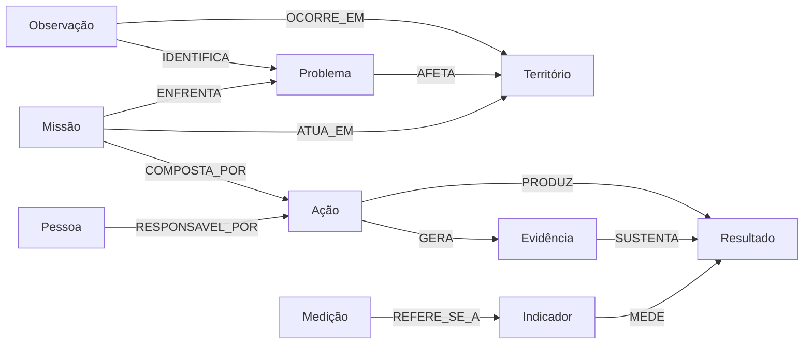

# Ontologia operacional

## Finalidade

A ontologia do Angico registra o percurso entre território, trabalho, autoria, evidência e resultado. Ela não é um catálogo abstrato: cada objeto precisa ter persistência, autorização, evento de origem e uso visível no produto.

O workspace é a fronteira de isolamento. Um objeto, uma relação ou um evento nunca pode ligar partições diferentes.

## Objetos canônicos

| Grupo | Tipos |
| --- | --- |
| Contexto | `WORKSPACE`, `TERRITORIO`, `LOCALIZACAO` |
| Rede | `PESSOA`, `ORGANIZACAO`, `PARTICIPACAO` |
| Diagnóstico | `OBSERVACAO`, `PROBLEMA`, `POTENCIALIDADE` |
| Mobilização | `MISSAO`, `ACAO`, `RECURSO`, `USO_RECURSO` |
| Comprovação | `EVIDENCIA`, `RESULTADO`, `INDICADOR`, `MEDICAO` |
| Coordenação | `CONVERSA`, `MENSAGEM`, `ANEXO` |

Novos tipos entram somente quando possuem contrato de criação, permissão, memória e consumidor real. Tarefas, coletas, lotes e incidentes permanecem fora do vocabulário atual até que esses quatro pontos existam.

`PESSOA` representa tanto participantes do território quanto pessoas autenticadas. Um participante pode existir sem Angico ID; a identidade de login e o acesso a workspaces são concedidos separadamente por associações ativas. Ao consultar um workspace secundário, membros ativos aparecem no contexto dessa partição sem alterar o workspace de origem da pessoa.

## Relações canônicas



Relações adicionais preservam participação e coordenação:

- `PESSOA PARTICIPA_DE ORGANIZACAO`;
- `ORGANIZACAO CONDUZ|MOBILIZA MISSAO`;
- `ACAO UTILIZA RECURSO`;
- `POTENCIALIDADE EXISTE_EM TERRITORIO` e `APOIA MISSAO`;
- `CONVERSA PERTENCE_A TERRITORIO` ou `REFERE_SE_A` um objeto autorizado;
- `CONVERSA TEM_PARTICIPANTE PESSOA`;
- `MENSAGEM ENVIADA_EM CONVERSA`, `ENVIADA_POR PESSOA`, `MENCIONA` um objeto e `ANEXA ANEXO`.

A lista executável permanece em `OntologyService`. Gravações inválidas abortam a mesma transação que salvaria o objeto de domínio.

## Memória canônica

Há uma única projeção operacional:

- `memory_object`: identidade, nome, estado e origem do objeto;
- `memory_relation`: relação tipada, autoria, contexto, fonte, vigência e identidade ativa;
- `memory_event`: fato imutável com ordem do domínio e ordem do sistema.

Campos essenciais de um evento:

| Campo | Uso |
| --- | --- |
| `eventId` | identidade pública estável |
| `sequence` | ordem de commit dentro do banco |
| `entityType` e `entityId` | objeto afetado |
| `actorId` | autoria autenticada |
| `occurredAt` | quando o fato ocorreu no território |
| `recordedAt` | quando o servidor o confirmou |
| `deviceId` | origem local, quando aplicável |
| `idempotencyKey` | proteção contra repetição |
| `syncStatus` | `SERVER_RECORDED` ou `SYNCED_FROM_OFFLINE` |
| `schemaVersion` | versão do payload |

`occurredAt` ordena o trabalho. `recordedAt` e `sequence` auditam a chegada ao sistema. Uma sincronização tardia não reescreve o momento ocorrido.

## Invariantes

1. O ator e os workspaces permitidos vêm da sessão; IDs do payload não ampliam acesso.
2. Origem e destino de uma relação pertencem ao mesmo workspace.
3. Uma relação ativa possui identidade única; repetição idêntica é inócua.
4. Evidência aponta para um objeto existente e autorizado.
5. Resultado não é impacto comprovado sem evidência que o sustente.
6. Indicador sem medição expressa intenção de acompanhar, não resultado medido.
7. Mensagens preservam a permissão da conversa mesmo quando mencionam outro objeto.
8. O Rastro é somente leitura e não cria objetos, eventos ou relações para preencher lacunas.
9. Uma mutação sempre declara seu workspace; ausência ou associação sem papel de escrita encerra a operação antes de alterar o domínio.

## Rastro Verificável

O endpoint `GET /api/rastro/{rootType}/{rootId}` aceita raiz `TERRITORIO`, `MISSAO` ou `ACAO`. A resposta contém etapas, relações, eventos, participantes, lacunas, limites e o instante da leitura.

As lacunas possuem códigos estáveis, entre eles:

- `TERRITORIO_SEM_ORIGEM`;
- `MISSAO_SEM_TERRITORIO` e `MISSAO_SEM_ACAO`;
- `ACAO_SEM_MISSAO`, `ACAO_SEM_TERRITORIO`, `ACAO_SEM_AUTORIA`, `ACAO_SEM_EVIDENCIA` e `ACAO_SEM_RESULTADO`;
- `RESULTADO_SEM_EVIDENCIA` e `RESULTADO_SEM_INDICADOR`;
- `INDICADOR_SEM_MEDICAO`;
- `REGISTRO_SEM_EVENTO`.

Cada lacuna descreve uma relação esperada. Criar uma relação fecha apenas a lacuna correspondente; não existe nota agregada ou selo automático.

## Evolução

- mudanças de payload incrementam `schemaVersion` sem alterar eventos antigos;
- novos tipos e relações exigem teste em `OntologyServiceTest`;
- mudanças de schema são aditivas e versionadas por Flyway para H2 e PostgreSQL;
- remoções exigem período de leitura compatível e migração explícita;
- projeções podem ser reconstruídas a partir dos registros canônicos, sem inventar vínculos ausentes.

## Consultas

```text
GET /api/history/workspaces/{workspaceId}
GET /api/history/workspaces/{workspaceId}?entityType={type}&entityId={id}
GET /api/ontology/graph?workspaceId={workspaceId}&entityType={type}&entityId={id}
GET /api/rastro/{rootType}/{rootId}?workspaceId={workspaceId}
```

Todas as consultas privadas revalidam a associação ao workspace antes de ler a memória.
