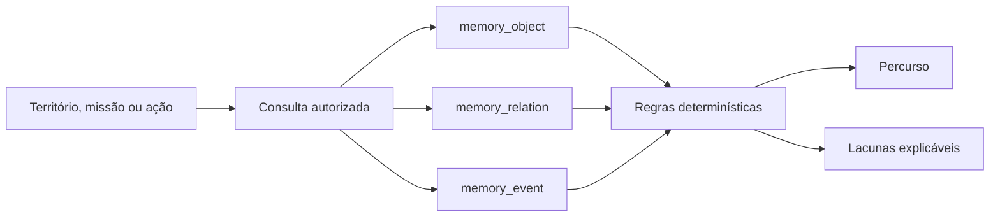

# Rastro Verificável

## Decisão de produto

Três conceitos foram avaliados para a função diferenciada do Angico.

### 1. Rastro Verificável

Compõe o percurso entre território, origem da ação, missão, atividade, evidência, resultado e indicador. Mostra relações comprovadas e lacunas objetivas, sem transformar completude em nota.

- Problema: resultados aparecem separados do contexto, da autoria e da prova que os sustenta.
- Usuários: coordenação, agentes de campo, organizações parceiras e comunidades.
- Valor: permite revisar o que está demonstrado e qual registro ainda falta.
- Originalidade: usa a ontologia operacional como navegação e verificação, não como grafo decorativo.
- Viabilidade: alta; lê objetos, relações e eventos já canônicos.
- Dados: memória operacional, evidências, resultados, indicadores e medições.
- Dependência de modelos generativos: nenhuma.
- Offline: o último rastro sincronizado pode ser consultado; novos registros entram pela outbox.
- Riscos: regras excessivamente rígidas ou falsa sensação de certificação.
- MVP: percurso determinístico, lacunas explicáveis e links para os objetos de origem.

### 2. Revezamento territorial

Organiza a passagem de uma atividade entre pessoas e turnos, preservando contexto local, pendências, localização e evidências disponíveis.

- Problema: trabalhos de campo interrompidos perdem contexto entre equipes.
- Usuários: agentes de campo e coordenação operacional.
- Valor: reduz retrabalho e perda de informação.
- Originalidade: combina handoff, operação offline e relações territoriais.
- Viabilidade: média; exige tarefas, aceite, disponibilidade e regras de escalonamento mais maduras.
- Dados: ações, responsáveis, mensagens, localização, restrições e anexos.
- Dependência de modelos generativos: nenhuma.
- Offline: forte, desde que conflitos de atribuição sejam resolvidos na reconexão.
- Riscos: atribuição desatualizada e conflito entre duas equipes.
- MVP: ficha de passagem com aceite e histórico.

### 3. Caderno de decisões

Registra decisões tomadas em conversas operacionais e liga cada decisão aos fatos, participantes, ações e evidências que a motivaram.

- Problema: decisões importantes ficam escondidas em mensagens e não chegam ao histórico do objeto.
- Usuários: coordenação, conselhos comunitários e parceiros.
- Valor: melhora continuidade, responsabilidade e revisão posterior.
- Originalidade: transforma comunicação em memória causal sem resumir ou inferir automaticamente.
- Viabilidade: média-alta; depende da reconstrução das mensagens e de um fluxo explícito de confirmação.
- Dados: conversa, mensagem, participantes, objeto de contexto e decisão confirmada.
- Dependência de modelos generativos: nenhuma; extração automática seria apenas uma extensão opcional.
- Offline: rascunho e confirmação local podem entrar na fila.
- Riscos: registrar opinião como decisão ou expor conversa fora de sua permissão.
- MVP: ação “Registrar decisão” em uma mensagem autorizada.

## Critérios e escolha

| Critério | Rastro | Revezamento | Caderno de decisões |
| --- | --- | --- | --- |
| Dor central do Angico | Alta | Média | Alta |
| Usa ontologia e histórico | Alta | Alta | Alta |
| Mostra fonte e evidência | Alta | Média | Alta |
| Opera sem precisão falsa | Alta | Alta | Alta |
| Viabilidade com o domínio atual | Alta | Média | Média |
| Valor visual em demonstração | Alta | Média | Média |
| Funciona parcialmente offline | Alta | Alta | Média |
| Risco de escopo | Baixo | Alto | Médio |

O Rastro Verificável foi escolhido porque resolve a lacuna mais estrutural: demonstrar como uma ação se conecta ao território e a um resultado sem ocultar o que ainda não está comprovado. O conceito também fortalece os módulos existentes em vez de criar uma aplicação paralela.

## Experiência

1. A pessoa escolhe um território, missão ou ação que já pode acessar.
2. O Angico carrega somente objetos, relações e eventos do mesmo workspace.
3. O percurso é ordenado pela cadeia canônica:

   `Território → Observação/Potencialidade → Missão → Ação → Evidência → Resultado → Indicador`

4. Pessoas, organizações e recursos aparecem no ponto em que participaram.
5. Cada etapa abre sua autoria, origem, momento ocorrido, momento registrado e evidências.
6. Uma relação ausente produz uma lacuna com motivo e próximo registro possível.
7. O usuário navega para o módulo de origem; a consulta do Rastro não cria nem corrige dados automaticamente.

## Regras do MVP

- Não existe nota, percentual de confiança ou selo automático.
- Uma lacuna corresponde a uma relação, evento, autoria, evidência ou medição ausente.
- Adicionar uma relação fecha apenas a lacuna correspondente.
- Resultado sem evidência continua não comprovado.
- Evidência sem objeto de origem não é aceita.
- Indicador sem medição pode mostrar intenção de acompanhamento, não impacto medido.
- Medição sem indicador válido não entra no percurso.
- Eventos usam `occurredAt` para a sequência do trabalho e `recordedAt` para a sequência do sistema.
- Registros offline continuam identificados como sincronizados posteriormente.
- Consultar o Rastro é uma operação somente de leitura.

## Arquitetura

O backend fornece um read model sobre `memory_object`, `memory_relation` e `memory_event`. Ele não possui tabela própria de eventos e não copia entidades de domínio.

A API deve devolver:

- raiz e workspace;
- etapas existentes do percurso;
- relações canônicas;
- eventos relevantes;
- participantes laterais;
- lacunas com código estável, motivo, ação seguinte e tipo esperado.

O app apresenta a sequência como registro navegável e mantém estados de carregamento, vazio, falta de permissão e falha. Não desenha nós que a API não devolveu.

## Segurança

- A API deriva ator e associações da sessão.
- O workspace solicitado precisa estar entre as associações ativas.
- IDs de outro workspace não podem expandir o grafo.
- Conversas e anexos mantêm suas próprias permissões; estar no mesmo rastro não amplia acesso.
- A resposta não inclui caminho físico de arquivo, credencial, email privado ou payload sem uso na experiência.
- A consulta possui limite de nós e relações para evitar expansão sem controle.

## Funcionamento offline

O Rastro é uma leitura composta, portanto a versão completa exige dados sincronizados. O app pode manter o último read model da partição ativa e exibir sua data de atualização. Novas observações e evidências entram na outbox com UUID e idempotência; a interface distingue o registro local do percurso confirmado pelo servidor.

Conflitos nunca são fechados localmente por inferência. A pessoa revisa ou reenvia o objeto e o Rastro é recalculado após confirmação.

## Métricas de sucesso

- tempo para identificar por que um resultado não está comprovado;
- proporção de ações com autoria, território, evidência e resultado ligados;
- tempo entre registro offline e confirmação remota;
- número de lacunas fechadas por relação válida;
- acessos do Rastro que terminam na abertura de um objeto de origem;
- redução de resultados publicados sem evidência vinculada.

Essas métricas avaliam uso e qualidade do registro. Elas não formam uma pontuação pública de impacto.

## Limitações

- O Rastro comprova consistência e proveniência do que foi registrado; não certifica a veracidade material do mundo físico.
- Qualidade ruim de uma evidência não é resolvida por possuir um arquivo.
- A primeira versão não infere causalidade nem recomenda decisões.
- Fluxos especializados de resíduos podem adicionar relações próprias depois, sem redefinir a cadeia socioambiental inteira.
